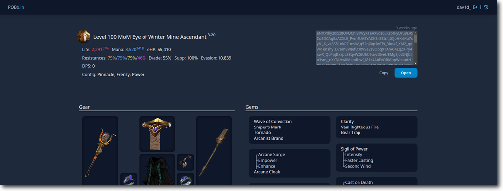

Paste of Exile
==============

[![Build Status][actions-badge]][actions-url]
[![License][license-badge]][license-url]

[actions-badge]: https://img.shields.io/github/actions/workflow/status/dav1dde/pasteofexile/ci.yaml?branch=master&style=for-the-badge&logo=github
[actions-url]: https://github.com/Dav1dde/pasteofexile/actions?query=workflow%3ACI+branch%3Amaster
[license-badge]: https://img.shields.io/badge/license-AGPL-blue.svg?style=for-the-badge
[license-url]: ./LICENSE

[pobb.in](https://pobb.in), a pastebin for [Path Of Building](https://pathofbuilding.community/) builds.





## Development

Required dependencies:

* Node 16.7+
* Yarn
* Latest Rust (including wasm toolchain: `rustup target add wasm32-unknown-unknown`)
* Perl (on Windows you can use [Strawberry Perl](https://strawberryperl.com/))
* wrangler: `cargo install wrangler`
* TrunkRS: `cargo install trunk`
* worker-build: `cargo install worker-build`
* wasm-pack: `cargo install wasm-pack`

The application can be started with:

```sh
$ yarn start
```

To just build the application:

```sh
$ ./build.sh --dev
$ ./build.sh --release
```

### Code

Rust code is formatted with `cargo +nightly fmt` and linted with `cargo +nightly clippy --all-features -- -D warnings`.

Commits are prefixed with their scope/crate:

* `poe:` relevant for the entire project
* `app:` the frontend
* `pob:` pob parsing and tools
* `poe-tree`: poe tree parsing and processing
* `shared`: mainly types shared between `app` and `worker`
* `snapshot:` just a cli tool to generate stats
* `worker:` the backend


## Public API

For third-party integrations there are currently two public URLs to retrieve a build:

* `/:id/raw`
* `/u/:username/:id/raw`

Please always include a `User-Agent` which identifies your application and includes contact info, e.g.:
`User-Agent: app-name/version hosted.domain (contact: foo@bar, discord#0000)`.


## Contributing

Contributions are always welcome, code, design ideas, mockups etc.

When contributing please try to follow coding conventions (`cargo fmt`, `cargo clippy`),
code style and commit formatting.

Before working on big features please open an issue/discussion first or reach out (e.g. `#tooldev-general`
on the official discord), in case this feature is currently out of scope or already being worked on.
